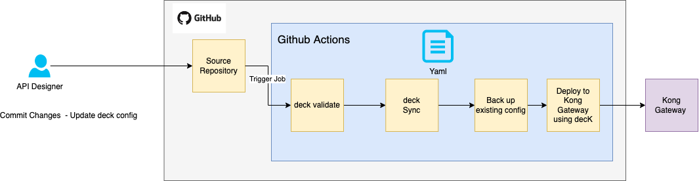

# kong-se-deck-flow



Reference flow for using Deck to deploy your Kong configurations, and using Github Actions

For this set-up, we will only apply changes to a dev workspace.

We will use Github Actions to do the following

1. Validate the decK declarative configuration
2. Back-up Existing deck configuraiton for a particular workspace
3. Sync/Apply new changes , and run deck sync to apply on a remote Kong Admin API
4. On failure, re-apply the backup configurations to Kong

## Important ENV Variables

You can create the following secrets in Github, and inject them as part of Github Actions.

```
    DECK_KONG_ADDR: ${{ secrets.KONG_ADMIN_API_URL }}
    DECK_HEADERS: ${{ secrets.KONG_DECK_HEADERS }}
```

1. KONG_ADMIN_API_URL - Admin API URL
2. KONG_DECK_HEADERS - The Admin token required when authenticating against Kong Admin API. 

Something like this below

```export KONG_DECK_HEADERS="Kong-Admin-Token:xxxx"```


    